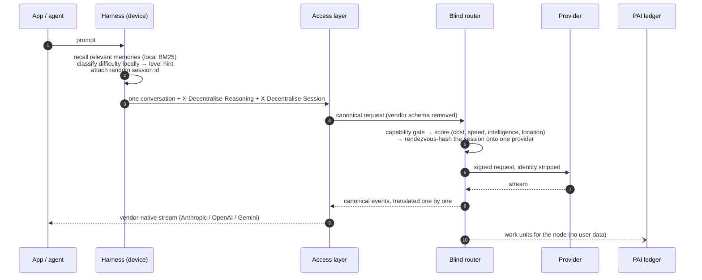
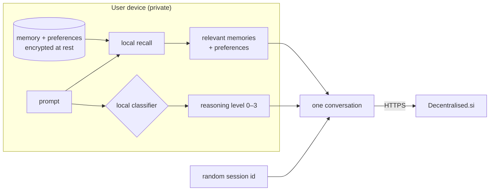
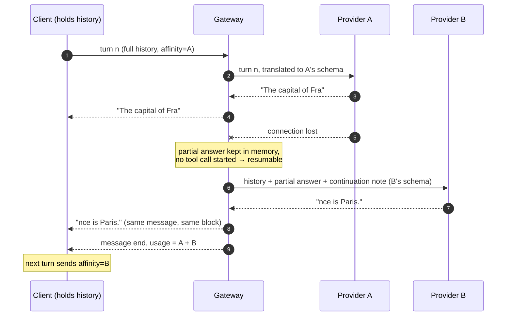
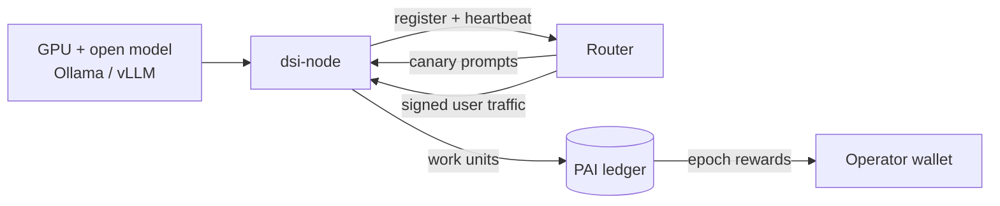

# Decentralised Super Intelligence

**How Decentralised.si routes every question to the right intelligence, privately, and pays everyone who powers it**

*Whitepaper v0.2 · 26 September 2026 · Decentralised.si*

---

## Abstract

Intelligence is becoming a utility, but today it is dispensed by a handful of vendors, each with its own API, its own prices, and a complete view of everything its users ask. Meanwhile millions of GPUs sit idle in homes, labs and data centres, and capable open-weight models are free to run.

Decentralised.si is the routing layer between applications and intelligence. Applications keep the SDK and code they already have and change one base URL. A **harness** on the user's device keeps their memory and preferences. A **blind router** picks, for each conversation, the cheapest provider that is capable, fast and private enough: the user's own commercial API accounts, or an open network of independent GPU operators. The router works without reading the query. Anyone can join the network by running one container next to an open-source model server, and is paid in **PAI**, a capped token. Its emission falls over time and as the network grows, a share of every fee is burned, and staking it unlocks access to the most capable ("novel") intelligence.

This paper describes the architecture, the privacy model, the provider network, and the PAI economics. It also states which parts run today and which are on the roadmap.

---

## 1. Design principles

1. **Drop-in, not another API.** Existing Anthropic, OpenAI and Gemini applications work unchanged, including streaming and tool calls. MCP-native agents connect directly.
2. **The user's knowledge stays with the user.** Memory, preferences and conversation history live in the harness on the user's device. The network sees one conversation at a time and nothing else.
3. **Route without reading.** The router decides from the *shape* of a request (size, tools, features) and a reasoning-level hint computed on the device. It does not inspect, log or classify prompt text.
4. **No single provider sees a user's whole life.** Each new conversation goes to a different equivalent provider. Turns within one conversation stay together.
5. **Capability before cost.** A cheaper model is never substituted if it cannot do what the request needs, such as tools, JSON schema, vision, context length or privacy level.
6. **Anyone can supply intelligence.** One command turns a GPU and an open model into a paid network node. Rewards follow verified work, not capital.
7. **Common knowledge gets cheaper; novel intelligence is earned.** Commodity answers fall in price every year. Frontier reasoning is rationed by stake, not by who you are.
8. **No provider is load-bearing.** Conversation state lives with the client, so any provider (or model family, or vendor) can fail between turns or mid-answer without interrupting the conversation.
9. **Supply follows usage.** PAI has a hard cap of 10B. Reward emission halves every two years and shrinks as the network grows. The investors-and-founders allocation unlocks only as real network fees accumulate, and fees and slashing burn supply.

---

## 2. Architecture


*Figure 1. Layers of the system. Everything above the dashed line runs on the user's device.*

| Layer | Runs where | Responsibility | Status |
|---|---|---|---|
| **Harness** (`dsi`) | User's device | Memory, preferences, local recall, difficulty hint, session ids; MCP server; local proxy | Implemented |
| **Access layer** | Edge (`api.decentralised.si`) | Anthropic, OpenAI and Gemini compatible APIs; MCP over Streamable HTTP | Implemented |
| **Blind router** | Edge, stateless | Canonical translation, capability gate, scoring, session sharding, failover, stream translation, identity stripping | Implemented |
| **Provider markets** | Vendors / operators | A: customer's own commercial keys (BYOK). B: community and specialist nodes | Implemented |
| **Verification** | Router + (phase 2) verifiers | Structural checks, canary prompts, reputation, slashing | Canaries implemented; verifier market phase 2 |
| **PAI settlement** | Off-chain ledger → chain | Work metering, epoch emission, burn, staking, bonds | Ledger + reference contract implemented; mainnet not launched |

### 2.1 Request lifecycle



---

## 3. The harness layer: memory lives on the device

The harness is the only component that knows the user. It is a small open-source program (`dsi`), shipped as a CLI, a local MCP server and a local OpenAI-compatible proxy.

- **Memory and preferences** are files on the device, encrypted at rest with a passphrase (AES-GCM, PBKDF2-derived key). They are never uploaded.
- **Local recall.** For each prompt, the harness ranks memories on the device (BM25). Only the few that are relevant go into *that request's* system prompt, and only for that request. In the test suite, a request about data cleaning carries the user's "prefers pandas" memory and nothing about their dog or their city.
- **Local difficulty classification.** The harness reads the prompt, on the device, and sends only a reasoning-level hint (`X-Decentralise-Reasoning: 0–3`). The router routes on the hint.
- **Unlinkable sessions.** Each conversation gets a random session id. The history of a conversation is held by the harness and replayed each turn, so the network needs no server-side conversation state.
- **Works with everything.** `dsi mcp` gives Claude Code, Claude Desktop and IDE agents tools for memory and private network access (`ask_network`, `remember`, `recall`, `forget`, `set_preference`). `dsi proxy` gives any OpenAI-compatible app the same memory without code changes.



---

## 4. The access layer: API and MCP

### 4.1 Drop-in vendor APIs

| Protocol | SDK base URL | Endpoints |
|---|---|---|
| Anthropic | `https://api.decentralised.si/anthropic` | `POST /v1/messages` (streaming), `/v1/messages/count_tokens`, `GET /v1/models` |
| OpenAI | `https://api.decentralised.si/openai/v1` | `/chat/completions`, `/responses`, `/embeddings`, `/models` |
| Gemini | `https://api.decentralised.si/gemini` | `:generateContent`, `:streamGenerateContent`, `:embedContent`, `:batchEmbedContents`, `:countTokens` |

Every protocol is translated to **one canonical representation** of messages, tools, tool choice, structured output, reasoning and a stream-event model (`message_start`, `content_delta`, `reasoning_delta`, `tool_call_start`, `tool_call_delta`, `usage`, `message_end`, `error`). The router only ever sees that representation. A developer using Anthropic tools receives Anthropic `tool_use` blocks even when OpenAI or Gemini generated the call. Streams are translated event by event, so time-to-first-token is preserved.

Routing is controlled without touching request bodies, via optional headers or the account's dashboard policy:

`X-Decentralise-Mode` (`passthrough`, `optimise`, `cheapest`, `fastest`, `quality`, `private`, `decentralised_only`, `byok_only`, `network_only`) · `X-Decentralise-Max-Cost` · `X-Decentralise-Max-Latency-Ms` · `X-Decentralise-Min-Quality` · `X-Decentralise-Privacy` · `X-Decentralise-Verification` · `X-Decentralise-Reasoning` · `X-Decentralise-Session`.

Every response reports its provenance (`x-decentralise-actual-provider`, `-actual-model`, `-market`, `-receipt`). The response body's `model` field always names the model that really answered.

### 4.2 MCP layer

`POST https://api.decentralised.si/mcp` speaks the Model Context Protocol (Streamable HTTP, JSON-RPC 2.0). Tools:

| Tool | Purpose |
|---|---|
| `ask` | Query the network; optional `reasoning_level`, `mode`, `session_id`, `model` |
| `explain_route` | Dry run: which providers would serve this request shape, and why others were rejected |
| `list_models` | Models the account can reach, with market, level and price |
| `network_status` | Nodes per reasoning level, utilisation, required stake, today's emission |
| `pai_account` | PAI balance and stake, and which levels the stake unlocks |

---

## 5. The blind router

### 5.1 What the router is allowed to know

The router sees the request *envelope*: token counts, number of turns, declared tools, response format, requested features, the client's reasoning hint and session id, and a coarse location from the edge. It does not read message text to route. When no hint is present, it uses only structural signals and never assumes the lowest level.

### 5.2 Selection

1. **Capability gate (mandatory).** A candidate is compatible only if it supports every required feature (tools, forced tool choice, parallel tools, JSON object/schema, vision, reasoning, stop sequences, prompt caching) and satisfies the context window, output limit, privacy level, verification level, vendor lock and PAI stake gate. Incompatible candidates are never chosen, whatever their price or quality.
2. **Hard constraints.** Maximum cost, maximum latency and a caller-set minimum quality.
3. **Quality target.** Each reasoning level has a soft target (L0 0.68 · L1 0.80 · L2 0.87 · L3 0.93). Candidates above it are preferred. If none reach it, the best compatible ones are used.
4. **Score.** In `optimise` mode each candidate `c` gets

   `score(c) = w_q·q̂(c) + w_c·ĉ(c) + w_l·l̂(c) + w_d·d(c)`

   where `q̂` is normalised quality, `ĉ` normalised log-cost (cheaper is higher), `l̂` normalised expected latency (faster is higher), and `d = 1` for network or decentralised providers. The default weights are 40/30/20/10 and each account sets its own. Expected latency is `TTFT + queue + 3·distance/100 km + tokens/throughput`, so a node in Sydney wins for a user in Melbourne and a node in London wins for a user in Paris.
5. **Session sharding.** Among candidates within a small band of the best score, the router picks the provider maximising `hash(session ‖ provider)` (rendezvous hashing). A conversation stays on one provider across turns. Different conversations spread evenly over equivalent providers, so no single operator can assemble a user's history across conversations.
6. **Failover.** Up to four attempts are made on rate limits, timeouts, overloads, refused connections or bad credentials, trying the best candidate of each *other* provider first and skipping every model of a provider that is down. If a stream fails after bytes have reached the client, the answer is continued on another provider inside the same response (§7.2).

In the test suite the router reproduces this example. Suppose a user has connected three providers:

| Candidate | Quality | Expected cost | Latency |
|---|---|---|---|
| A (commercial frontier) | 0.94 | $0.018 | 2.1 s |
| B (commercial mid) | 0.87 | $0.004 | 0.8 s |
| C (network node) | 0.84 | $0.001 | 0.5 s |

A simple request goes to C, a medium one to B and a hard one to A. The developer decides nothing manually.

### 5.3 What providers receive

Network providers receive a signed request (HMAC-SHA256 over timestamp and body hash, with a per-node secret) containing the conversation and generation parameters, and nothing else: no account id, API key, end-user id, IP address or memory store. The node agent strips identifying fields again on arrival as defence in depth. Customer BYOK keys are envelope-encrypted, decrypted only inside the outbound call to that customer's own vendor, and can never reach a network node.

---

## 6. Privacy and anonymity

| Party | Sees | Never sees |
|---|---|---|
| **Harness (device)** | Everything the user chooses to store | n/a |
| **Router** | One conversation in transit; envelope metadata; the account's ds_ key; coarse location for this decision | Stored memory; other conversations' content (nothing is logged); prompts in logs or receipts (hashes only) |
| **Network provider** | One conversation (or one of its turns), signed by the router | Who is asking; the account; IP; other conversations of the same user; any memory beyond what that request carries |
| **BYOK vendor** | What the customer already sent that vendor before adopting Decentralised.si | Anything from other vendors or other users |
| **PAI ledger** | Work units per node per epoch; payouts; stakes | Any request content or requester identity |

**Implemented today:**
- Client-side memory, recall and classification.
- Blind routing, session sharding and identity stripping.
- Signed node requests.
- Hash-only receipts: request and response content are stored as SHA-256 digests.
- Credential redaction everywhere.
- Envelope-encrypted BYOK keys bound to account and credential by AAD.

**Roadmap:**
- **Anonymous credit.** Blind-signed prepaid tokens (Privacy Pass style) so that even the router cannot link requests to an account. The ds_ key buys tokens; the tokens pay for requests.
- **Oblivious relays.** Oblivious HTTP relays in front of the access layer, so the router never learns the client IP.
- **Confidential nodes.** TEE-attested nodes (GPU confidential computing) for `X-Decentralise-Privacy: strict`, so the node operator cannot read the prompt either.

---

## 7. When a provider fails: continuity and isolation

A decentralised network is only credible if a conversation survives any single participant disappearing, and if spreading work across many participants does not spread a user's conversations with it. This section explains how Decentralised.si does both, compares it with centralised LLM services, and gives the argument, with the tests that check it, that the network does not depend on any one model, provider or vendor.

### 7.1 Where a conversation lives

The key design decision is that **no provider holds conversation state**. A conversation's context is held in two places:

| State | Held by | Lifetime |
|---|---|---|
| Full history (messages, tool calls and results) | The client (harness or application) | As long as the user keeps it |
| Long-term memory and preferences | The harness, on the device | Until the user deletes it |
| The partial answer of the turn in flight | The gateway, in memory (`StreamAccumulator`) | One turn; never persisted |
| Affinity: which provider served the last turn | The client, echoed in `X-Decentralise-Affinity` | One conversation |

Every request carries the full context the provider needs for that turn, translated into that provider's native schema by the protocol adapters. A provider is a pure function from context to next message. Losing it loses nothing that cannot be reproduced.

### 7.2 What happens when a provider goes offline

| When it fails | What the network does | What the client sees |
|---|---|---|
| **Before the first byte** of a turn | Fails over down a diversified candidate list: the best candidate of each *other* provider first, and every model of a provider that refused the connection is skipped | A normal response, a little later; `x-decentralise-failovers` counts the retries |
| **In the middle of a streamed answer** | The gateway keeps the partial answer, sends the conversation plus the partial answer and a one-line continuation note to the next compatible provider, and splices its stream into the same response: one `message_start`, one text block, usage summed | One uninterrupted message in its own protocol. The receipt records `resumedOn` |
| **Between turns** | The client's affinity points at a provider that is gone. The router skips it and picks the next equivalent one; the next response carries the new affinity | Nothing unusual |
| **The original provider comes back** | The client keeps echoing the new affinity, so the conversation **stays** with its replacement instead of bouncing back | Nothing |
| **A whole vendor or the whole network is down** | Candidates from other vendors and the other market remain; only an explicit `network_only` or `byok_only` policy can exclude them | An honest `5xx` only if *every* compatible provider is down |



Two cases are deliberately **not** papered over:

- **A tool call that was already streaming.** Its arguments are half-sent, and guessing the rest could run a real action with wrong inputs. The client receives an explicit error and retries the turn.
- **Passthrough mode.** The user asked for one specific model, so the turn is never continued on a different one.

### 7.3 Isolation: who can see a conversation

- **Exactly one recipient per turn.** A turn is sent to one provider. The only exception is shadow `benchmark` mode, which the customer must switch on explicitly.
- **Few providers per conversation.** With client-held affinity, the set of providers that ever see a conversation is the first provider plus one per failure that occurs during the conversation. In the normal case, that is one.
- **Conversations are not linkable across providers.** Session ids are random per conversation, rendezvous hashing spreads conversations over equivalent providers, and providers receive no account id, API key, end-user id or client IP. A provider cannot tell whether two conversations it served came from the same person, and it never receives conversations routed elsewhere.
- **The router keeps nothing readable.** Receipts store SHA-256 digests of content, logs contain no prompts, the partial-answer buffer lives only as long as the turn, and BYOK keys are envelope-encrypted.
- **On the wire.** Every hop uses TLS: client to edge, edge to vendor, and edge to node (through the node's tunnel). Router-to-node requests carry an HMAC over timestamp and body, so they cannot be injected, altered or replayed outside a five-minute window. A third party on the path sees ciphertext.

### 7.4 Compared with centralised LLM services

| | Centralised LLM service (one vendor, direct) | Decentralised.si |
|---|---|---|
| Where conversation history and memory live | On the vendor's servers, attached to your account | On your device. The network sees one turn's context, per request |
| One model or vendor has an outage | The service is down for everyone; streams in flight error out | The turn fails over to another provider or model family; an interrupted stream is continued in place |
| Architectural dependency | One model family, one API, one company | Any model behind any of the three vendor APIs or an OpenAI-compatible node; none is required |
| Who can see your conversations | One company sees all of them, linked to your identity and payment | Each provider sees only the conversations routed to it, without identity, and cannot link them |
| Retention | Under the vendor's policy | Router: hashes only. Nodes: the reference agent logs nothing. Strict mode: TEE nodes (roadmap) |
| Switching cost | Rewrite for another SDK, re-create memory | None: same SDK, same code; memory stays on the device |
| Who supplies intelligence | The vendor's own data centres | Commercial vendors *and* anyone with a GPU |

Multi-vendor gateways that retry on another API already exist, and they solve part of the availability problem. The differences here are that context and memory are held by the client, that routing works without reading prompts, that conversations are sharded and unlinkable across providers, that interrupted streams are continued rather than restarted, and that the supply side is open to anyone.

### 7.5 Why this works without relying on any one LLM

The claims above follow from five invariants of the design. Each is checked by the test suite in the Smart-LLM-Router repository (`apps/gateway/test/continuity.test.ts` and the SDK compatibility suites), with real Anthropic, OpenAI, Gemini and MCP client SDKs on one side and providers speaking each vendor's wire format on the other.

**I1 · Providers are stateless with respect to the conversation.** Everything a provider needs is in the request, and nothing it holds is needed later (§7.1).
*So:* removing any provider removes no conversation state. The only thing at risk is the partial output of the turn in flight, which the gateway holds.
*Test:* "provider goes offline between turns". Anthropic serves a tool call, then goes offline. The next turn, still asking for Anthropic, is served by another vendor. That vendor receives the complete history, including the tool call and its result, valid in its own schema, and not one byte of the turn reaches the offline provider.

**I2 · Every vendor schema maps to and from one canonical form.** Each adapter is a pair of translations (vendor → canonical, canonical → vendor) that preserve messages, tool calls, tool results, structured output and system instructions. The capability gate only admits providers that support every feature the conversation uses.
*So:* any conversation can move to any admitted provider.
*Test:* "one conversation across four unrelated model families". A single conversation is served turn by turn by Anthropic, then OpenAI, then Gemini, then an open-weight model on the network. Each receives the full history, including the other vendors' tool calls, and each vendor's schema validator reports zero errors.

**I3 · Failure handling covers every point in a turn.** Before the first byte: diversified failover. Mid-stream: continuation, when no tool call has started. Between turns: affinity miss, then re-route.
*So:* a turn completes whenever at least one compatible provider is reachable.
*Tests:* "provider dies in the middle of an answer" (Anthropic SDK and OpenAI SDK). The client receives one message whose text is the first provider's partial output followed by the second provider's continuation, with no error event. "Serves when every commercial vendor is down, and when the network is down" covers whole-market outages.

**I4 · One recipient per turn, few per conversation, no linkage.**
*Test:* "no sniffing". Three concurrent three-turn conversations, each carrying a secret marker. Each marker reaches exactly three provider requests (one per turn), all at a single provider. No request ever contains two conversations. No request contains the account id or key. None of the markers appears anywhere in the router's receipts, shadow records, node records, work ledger or logs.

**I5 · No component is special.** Providers are chosen per turn from whatever is compatible and reachable. The router is stateless and runs on every edge location. Clients can use any of three vendor protocols, or MCP.
*So:* there is no single model, provider or router instance whose loss ends a conversation.

**Availability, illustrated.** If a turn can be served by any of *k* independent compatible providers, each available a fraction *a* of the time, a turn fails only when all *k* are down at once: availability is `1 − (1 − a)^k`. With *a* = 99%, one provider gives 99%, two give 99.99% and three give 99.9999%. A single-vendor service is capped by that one vendor's availability. (Real outages are not perfectly independent: two nodes in the same region can fail together. Geographic and vendor diversity in the candidate list is what keeps the assumption close to true.)

### 7.6 Honest limits

- **The provider that serves a turn reads that turn's plaintext**, as every LLM provider does today. The design limits how *much* any provider sees (one conversation, unlinkable) rather than claiming it sees nothing. `X-Decentralise-Privacy: strict` with TEE-attested nodes (roadmap) closes this gap.
- **A failover provider sees the conversation's history**, because it must in order to answer. Affinity keeps this to one extra provider per failure.
- **Continuations are generated by a different model.** The text continues seamlessly and the receipt records the switch, but the style can shift slightly mid-answer. Passthrough mode never switches.
- **Hidden reasoning does not travel between vendors.** Vendor-signed reasoning (for example, Anthropic thinking signatures) is only valid on its own vendor, so it is dropped when a conversation moves. The visible conversation moves intact.
- **The router operator could, in principle, read traffic in flight**, because TLS terminates at the edge. Oblivious HTTP relays, anonymous credit and attested edge execution are the roadmap answers. Until then, the guarantee is policy and code (nothing is logged or persisted), not cryptography.

---

## 8. The provider network: fire up a server, earn PAI

### 8.1 Joining

```sh
curl -fsSLO https://decentralised.si/dl/docker-compose.yml
DSI_API_KEY=ds_live_... docker compose up -d          # Ollama + cloudflared + dsi-node
docker compose exec ollama ollama pull llama3.1:8b     # any open-weight model your GPU fits
```

Already running a model server? `node dsi-node.mjs up` with `LLM_BASE_URL` pointing at it (download from [/dl/dsi-node.mjs](/dl/dsi-node.mjs); checksums in [/dl/SHA256SUMS](/dl/SHA256SUMS)).

`dsi-node` wraps any OpenAI-compatible model server (Ollama, vLLM, llama.cpp, LM Studio, TGI). Cloudflare Tunnel gives it a public HTTPS address with no port forwarding or static IP. On start it:

- registers its models and declared reasoning levels, after the router probes the endpoint
- stores a one-time node secret
- verifies that every incoming request is signed by the router, and rejects everything else
- streams responses through without buffering
- heartbeats its load and queue depth every 30 seconds



### 8.2 Reasoning levels

| Level | Examples | Work multiplier | Knowledge class | Provider bond |
|---|---|---|---|---|
| **L0 · recall** | ≤ 8B models: lookup, rewrite, classify | ×1 | common | none |
| **L1 · general** | 8–70B: everyday Q&A, summaries, code help | ×2 | common | none |
| **L2 · reasoning** | 70B+ and reasoning models: multi-step analysis, agents | ×4 | novel | 100 PAI |
| **L3 · frontier** | frontier-class or long-thinking models | ×8 | novel | 1,000 PAI |

### 8.3 Work units: GPU, bandwidth and quality become rewards

For each verified response a node serves:

`WU = ( (0.25·input_tokens + output_tokens)/1000 × level_multiplier + 0.01·MB_transferred ) × (0.5 + reputation)`

Output tokens weigh four times input tokens because they dominate GPU time. The level multiplier prices model size and thinking time, bandwidth is paid directly, and reputation (0–1) scales rewards between ×0.5 and ×1.5. A response that fails verification earns zero. For a typical request of 1,000 input and 500 output tokens at full reputation, that is **1.13 WU at L0, 2.25 at L1, 4.50 at L2 and 9.00 at L3**.

### 8.4 Keeping nodes honest

- **Probation.** New nodes start with reputation 0.5, and their advertised quality is capped at `0.6 + 0.4·reputation` until they earn more.
- **Canaries.** Every 15 minutes the router sends each node synthetic prompts with known answers, harder for higher levels. They are generated by the network and never drawn from user data. Three passes promote a node to *active*; persistent failures suspend it.
- **SLA and verification.** Every served response updates reputation, based on structural verification (valid tool calls, schema-valid JSON) and whether latency stayed within twice the estimate.
- **Slashing (on-chain).** Model substitution caught by canaries: 50% of bond. False attestation by a verifier: 10%. Downtime while holding sessions: 1%. Slashed PAI is burned.

### 8.5 What an operator can earn

Illustrative figures from the reward formula, at launch-epoch emission, with 5,000 network participants and 5M work units per day across all providers. They are not a promise: earnings depend on network demand, total work and the PAI market.

| Node serving 2M output tokens/day at reputation 0.9 | Work units/day | PAI/day |
|---|---|---|
| L0 (e.g. 8B on a gaming GPU) | 4,901 | ~266 |
| L1 (e.g. 32B on a 24 GB card) | 9,801 | ~531 |
| L2 (e.g. 70B on a multi-GPU box) | 19,601 | ~1,059 |
| L3 (frontier-class open model) | 39,201 | ~2,110 |

Consumers pay for network inference in credit or PAI. Nodes earn epoch emission for verified work, and the fee flow funds operators once emission tapers.

---

## 9. PAI

### 9.1 Supply and allocation

Hard cap: **10,000,000,000 PAI**. Only 500M exists at genesis. Another 500M can only be minted as rewards for verified work. The remaining 9B belongs to private investors and founders; it is locked and minted only as network usage grows (§9.2).

| Allocation | PAI | Share | Notes |
|---|---|---|---|
| Investors and founders | 9,000,000,000 | 90% | Locked; minted in ten tranches as cumulative network fees pass milestones (§9.2) |
| Network rewards | 500,000,000 | 5% | Minted per epoch for verified work only; never pre-minted |
| Ecosystem treasury | 150,000,000 | 1.5% | Grants, audits, public goods |
| Contributors | 150,000,000 | 1.5% | 4-year vesting |
| Community | 120,000,000 | 1.2% | Early users and early node operators |
| Liquidity | 80,000,000 | 0.8% | Market making |

### 9.2 Investors and founders unlock as volume grows

The 9B investors-and-founders allocation is not minted at genesis. It is released in ten tranches of **900M PAI**. Each tranche is minted once, when the network's cumulative fees reach its milestone. Time alone unlocks nothing: supply for investors and founders grows only as paying usage does.

| Tranche | Cumulative network fees | Unlocked in total | In the Figure 2 scenario |
|---|---|---|---|
| 1 | $1M | 900M | year 1.8 |
| 2 | $2.5M | 1.8B | year 2.3 |
| 3 | $5M | 2.7B | year 2.5 |
| 4 | $10M | 3.6B | year 2.8 |
| 5 | $25M | 4.5B | year 3.1 |
| 6 | $50M | 5.4B | year 3.5 |
| 7 | $100M | 6.3B | year 4.1 |
| 8 | $250M | 7.2B | year 5.7 |
| 9 | $500M | 8.1B | year 8.5 |
| 10 | $1B | 9.0B | not reached within 10 years |

Cumulative fees are reported by the metering oracle (the settler role), which later moves to a verifier quorum (§12). The reported figure can only increase, and a tranche can never be minted twice. Fees are real payments, and 30% of fee value is burned, so inflating volume to force an unlock costs the payer real money.

### 9.3 Emission falls over time and as the network grows

An epoch is one day. Epoch emission is

`E(e, N) = E₀ · 2^(−e/730) · √( N₀ / (N₀ + N) )`

- `E₀ = 474,533 PAI/day`, chosen so the undamped schedule sums to exactly the 500M reward pool.
- Emission **halves every two years**.
- The damping term shrinks it further as the network grows, where `N` is active providers plus weekly active requesters and `N₀ = 10,000`.

Damping values: 1.0 at N = 0, 0.71 at 10k, 0.50 at 30k, 0.30 at 100k, 0.10 at 1M. PAI that damping withholds is never minted. The Solidity contract uses the same formula, and its tests match the TypeScript values.

| Year | Base emission / day | With 1k participants | With 100k | With 1M |
|---|---|---|---|---|
| 0 | 474,533 | 452,449 | 143,077 | 47,218 |
| 1 | 335,546 | 319,930 | 101,171 | 33,388 |
| 2 | 237,267 | 226,225 | 71,539 | 23,609 |
| 4 | 118,633 | 113,112 | 35,769 | 11,804 |
| 10 | 14,829 | 14,139 | 4,471 | 1,476 |

Each epoch's emission is split **70% to providers, 20% to verifiers and 10% to relays**, pro rata to verified work within each role. A role that did no work in an epoch receives nothing, and that share is not minted.

### 9.4 Burn

**30% of every fee** paid in PAI is burned, and slashed stake is burned. Reward emission falls with time and growth while burn rises with usage, so between tranche unlocks net issuance turns negative as the network succeeds.


*Figure 2. One adoption scenario, not a forecast, generated from `packages/pai`. The network grows along an S-curve to 1M participants and network fees to $250k/day, and the PAI price tracks usage as the square root of fee growth from $0.10. Supply starts at the 500M genesis allocation. It steps up by 900M each time cumulative fees pass an investors-and-founders milestone: nine of the ten tranches unlock within ten years, and supply reaches ~8.7B. Fee burn overtakes reward emission around year 2.7, so supply falls slowly between unlocks.*

### 9.5 Common knowledge gets cheaper; novel intelligence requires stake

**Common knowledge (L0–L1).** The network price multiplier falls **35% per year** and with the fourth root of capacity growth, with a floor at 5% of the launch price. With serving capacity growing 16×, the multiplier is ×0.33 after one year and ×0.06 after five.

| Year | Price multiplier | …with 16× capacity |
|---|---|---|
| 0 | 1.00 | 0.50 |
| 1 | 0.65 | 0.33 |
| 2 | 0.42 | 0.21 |
| 3 | 0.27 | 0.14 |
| 5 | 0.12 | 0.06 |

**Novel intelligence (L2–L3) on the network** requires staked PAI. Stake is locked, not spent, and the requirement rises with congestion:

`required_stake(level, u) = base(level) · (1 + 4u²)`, with base L2 = 1,000 PAI, L3 = 10,000 PAI and `u` the tier's utilisation.

| Utilisation | L2 stake | L3 stake |
|---|---|---|
| 0% | 1,000 | 10,000 |
| 25% | 1,250 | 12,500 |
| 50% | 2,000 | 20,000 |
| 75% | 3,250 | 32,500 |
| 100% | 5,000 | 50,000 |

Stake also sets a daily quota (for L3, 500k tokens per 10,000 PAI staked). Unstaking unbonds over 7 days. Commercial frontier models reached through a customer's own keys are not stake-gated, because the customer already pays that vendor.

### 9.6 Roles and who secures the network

| Role | Requirement | Earns | Can be slashed for |
|---|---|---|---|
| Provider (L0–L1) | Run `dsi-node` | 70% pool, by work units | Downtime while holding sessions |
| Provider (L2 / L3) | 100 / 1,000 PAI bond | Same, higher multipliers | Model substitution (50%) |
| Verifier (phase 2) | 5,000 PAI stake | 20% pool, by verification work | False attestation (10%) |
| Relay / edge router (phase 2) | Run an access-layer edge | 10% pool, by relayed work | Tampering, downtime |
| Consumer | None for common knowledge | Cheaper answers over time | n/a |

### 9.7 The contract

`contracts/src/PAI.sol` is the reference ERC-20 in the Smart-LLM-Router repository, to be opened for public review before any deployment. It implements the 10B capped supply, genesis allocations, the investors-and-founders tranches unlocked by reported cumulative fees, epoch settlement with the emission and damping formula, the 30% fee burn, staking with 7-day unbonding, and slashing by burn. Its Foundry test suite covers allocation, tranche unlocking (milestones only, never twice, never above the cap), halving and damping parity with the TypeScript model, pro-rata settlement, single settlement per epoch, fee burn, staking, slashing and the reward cap. Until an audited contract is deployed, the router runs the same economics on an off-chain ledger, settled daily and exposed at `/api/network`.

---

## 10. Security and economic attacks

| Attack | Defence |
|---|---|
| Node claims a bigger model than it runs | Level-specific canaries; reputation-capped quality; L2/L3 bonds slashed 50% |
| Node returns garbage to farm rewards | Structural verification; unverified responses earn 0 WU; reputation decay |
| Sybil nodes | Rewards follow verified work, not node count; probation; bonds for high levels |
| Traffic from outside the router | HMAC-signed requests; nodes reject unsigned traffic |
| Node tries to profile users | Identity stripping; session sharding across operators; TEE nodes for strict privacy (roadmap) |
| Router operator profiles users | No content logging; hash-only receipts; memory on device; anonymous credit and OHTTP relays (roadmap) |
| BYOK key theft | Envelope encryption with AAD binding; decrypted only in the outbound call; redaction; never sent to nodes |
| Faking fee volume to unlock investor tranches | Fees are real payments with 30% burned; cumulative fees only go up and each tranche mints once; the reporting role moves to a verifier quorum |
| Wash trading to farm emission | Emission damped by network size; fees partly burned; paying yourself costs more than it earns once fees are burned |
| Prompt injection from a malicious node | Responses are data to the client; the harness never grants a provider tool access |

---

## 11. Scalability and efficiency

- **Stateless edge router.** No per-user state. Session affinity comes from hashing, not from a table, so the router scales horizontally on a global edge (Cloudflare Workers today).
- **No buffering.** Streams are translated event by event, with failover only before the first byte.
- **Batching-friendly nodes.** Sessions are sticky per conversation, so nodes reuse KV caches across turns.
- **Geo-aware routing.** Distance enters expected latency, so the nearest adequate node wins latency-sensitive traffic.
- **Cheap control plane.** Work is metered per node per epoch, not per request. Settlement is one transaction per epoch.
- **Open protocols throughout.** Vendor-compatible APIs, MCP, OpenAI-compatible nodes and an ERC-20 token.

---

## 12. Governance

At launch the Decentralised.si foundation holds the contract's owner role and operates the reference router. Governance is handed over in stages:

- the settler role (the metering oracle) moves to a verifier quorum
- the slasher role moves to verifier consensus with an appeal window
- parameter changes (reward split, burn rate, stake bases) move to PAI-weighted governance with a time lock

Emission constants, the hard cap and the investors-and-founders unlock milestones are immutable.

---

## 13. Status

| Component | Status |
|---|---|
| Anthropic / OpenAI / Gemini drop-in APIs, streaming, tool translation | **Live** |
| Capability engine, nine routing modes, headers and account policies | **Live** |
| BYOK with envelope encryption; shadow routing (estimate / benchmark) | **Live** |
| Blind routing, client hints, session sharding, geo-aware latency, identity stripping | **Implemented** in this release |
| MCP layer (`/mcp`) | **Implemented** in this release |
| Mid-stream continuation on another provider; client-held affinity; provider-diversified failover | **Implemented** in this release |
| Harness `dsi`: local memory, preferences, recall, MCP server, proxy | **Implemented** in this release |
| `dsi-node` + Docker Compose; permissionless registration, heartbeats, signed requests | **Implemented** in this release |
| Canaries, reputation, probation, suspension | **Implemented** in this release |
| PAI off-chain ledger: staking, stake-gated L2/L3, work metering, daily settlement | **Implemented** in this release |
| PAI Solidity contract with tests | **Reference, unaudited, not deployed** |
| Verifier and relay markets | Phase 2 |
| Anonymous credit, OHTTP relays, TEE nodes | Roadmap |
| Token generation event / mainnet | Not scheduled |

---

## 14. Get started

**Use it.** Create a key at [decentralised.si/dashboard](/dashboard) and change one base URL:

```python
from anthropic import Anthropic
client = Anthropic(api_key="ds_live_...", base_url="https://api.decentralised.si/anthropic")
```

**Keep your memory private.**

```sh
mkdir -p ~/.local/bin && curl -fsSL https://decentralised.si/dl/dsi.mjs -o ~/.local/bin/dsi && chmod +x ~/.local/bin/dsi   # Node 20+
dsi login ds_live_...
dsi remember "I prefer concise answers with code first"
dsi chat
claude mcp add dsi -- dsi mcp     # the same memory in Claude Code
```

**Supply intelligence.** See §8.1. Then run `dsi-node earnings`.

---

## Disclaimer

This paper describes software and a proposed token design. PAI has not been issued, and nothing here is an offer to sell or a solicitation to buy any token or security. PAI is designed as a utility for staking, bonding and network fees, not as an investment. Figures are model outputs under stated assumptions, not forecasts or promises of return. The PAI contract is unaudited. Token launch will be subject to the laws of each relevant jurisdiction and may not occur.
